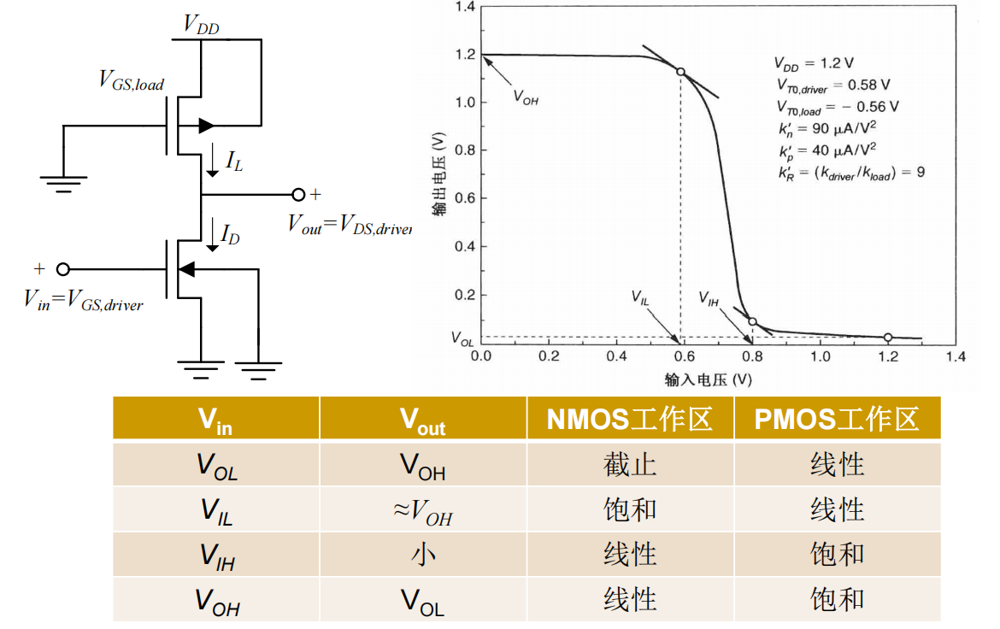
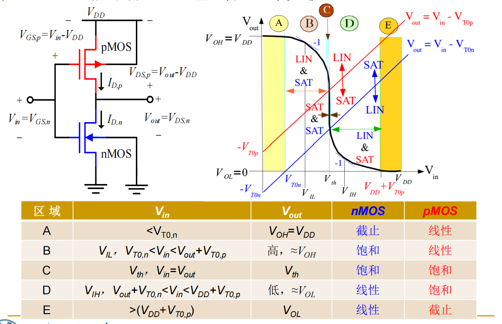

# 数字集成电路设计 - 笔记

## 01 绪论
本课程核心：
- CMOS数字电路基本单元的电路结构、静态和动态性能参数、版图设计等

主要内容：
- COMS反相器（静态特性/开关特性和互连线的影响）
- CMOS组合逻辑电路
- CMOS时序逻辑电路（和组合逻辑电路都属于重点）
- 动态逻辑电路
- 半导体存储器
- 运算电路：全加器/加法器/乘法器/移位器
- 时钟电路和输入输出电路
- 其他：设计方法学/时序问题/EDA设计工具等

绪论内容：
1. 集成电路发展历史：
  - 直接跳过
  - 摩尔定律以及对应的扩展
2. 数字集成电路：
  - 最根本的特征：离散时间/离散幅值
  - 优势：
    - 对待复杂电路能够实现高层次抽象/能够忽略不必要的噪声等实现高精确度/有先进工具支持
3. 同步电路：
  - 所有状态翻转发生在同步时钟的跳变沿，所有触发器状态改变都与时钟同步
  - 优点：
    - 设计方法成熟/EDA软件支持好/可以做STA（静态时序分析）
    - 时钟沿之间可以有glitch，不需要特别考虑竞争与冒险/但需要满足建立时间和保持时间/时钟周期大于最大延迟
      - 时钟沿之间可以有glitch -> 组合逻辑在时钟沿之间的输出可能存在毛刺(glitch)，但只要在时钟有效沿到来时数据满足建立时间和保持时间，这些毛刺不会影响系统状态
  - 设计挑战：
    - 时钟偏斜（clock skew）/要求时钟同步
    - 功耗大/时钟树功耗问题
    - 电路具有强耦合关系，不利于面积优化与低功耗优化，不灵活
      - 强耦合：同步电路中所有电路受统一时钟电路操控，且常有流水线结构，信号沿不同模块层层传递，要是其中一个电路改变，可能会影响下游大量电路
4. 异步电路：
  - 采用请求req和应答ack的握手方式进行通信，没有统一的时钟信号
  - 优势：
    - 功耗低/面积小/无需考虑时钟偏斜
    - 可以针对性优化面积和功耗
  - 设计挑战：
    - 实现握手需要耗费额外的异步控制单元
    - 缺乏成熟的设计方法和EDA工具/设计难度大
    - 验证/性能分析/优化难度大
    - 必须消除电路的竞争/冒险和毛刺
5. 数字电路的设计层次（从高到低）
  - 系统级
  - 算法级
  - 寄存器传输级
  - 门级
  - 晶体管级
  - 版图级
6. 集成电路的成本
  - 芯片成本 = 每个芯片的可变成本 +（固定成本 / 芯片的产量）
  - 其中可变成本是与芯片数量等成比例的
  - 固定成本NRE是可以重复使用的工具/人力/宣传等的费用，其中掩模版制造占主要
  - 其实Die（裸芯）的成本和其面积四次方成正相关，所以芯片面积优化对成本有很大影响

部分器件知识：
- 二极管：
  - 数字集成电路/数字IC中的主要作用：反偏隔离+ESD保护
  - 一般不直接使用，但其作为寄生元件几乎无处不在
- MOS晶体管：
  - 以数字方向看，一个MOS晶体管相当于一个开关
  - 长／短沟道的MOS晶体管I-V公式
    - 长沟道NMOS：
      - V_GS<V_T：截止，近似I_D＝０
      - V_DS>V_GS-V_T：饱和区，满足: $I_D=\frac{\mu_nC_{OX}}{2}\frac{W}{L}{(V_{GS}-V_T)}^2(1+\lambda V_{DS})$
      - V_DS<V_GS-V_T：线性区，满足: $I_D=\mu_nC_{OX}\frac{W}{L}((V_{GS}-V_T)V_{DS}-\frac{V_{DS}^2}{2})$
    - 短沟道NMOS：
      - 饱和电压改变（加分之乘）: $V_{DSAT}=\frac{(V_{GS}-V_T)\cdot E_CL}{(V_{GS}-V_T)+E_CL}$
      - 饱和区的IV公式是在长沟道基础上 $\cdot \frac{1}{1+\frac{(V_{GS}-V_T)}{E_CL}}$
      - 线性区的IV公式是在长沟道基础上 $\cdot \frac{1}{1+\frac{V_{DS}}{E_CL}}$
  - 寄生电容
  - 短沟道效应

## 02  MOS反相器静态特性
具体内容：
1. 反相器特性指标/参数：
  - V_OH：最大输出高电平，V_OL：最小输出低电平
    - V_OH越大越好，V_OL越小越好
  - V_IH：最小高输入电平，V_IL：最大低输入电平
  - Vth：反相器逻辑阈值点，Vth=V_in=V_out
  - （以及它们的计算方式：最高最低点/斜率为-1处）
2. 噪声容限：
  - 高电平噪声容限NM_H=V_OH-V_IH
  - 低电平噪声容限NM_L=V_IL-V_OL
  - 影响反相器的抗干扰能力，相对越大越好
3. 其他：
  - 芯片功率的限制因素：结温
  - 芯片功耗P：包括静态功耗和动态功耗
    - 静态功耗=直流功耗= $P_{DC}=V_{DD}I_D(V_{in}=V_{OH}orV_{OL})$
    - 若1和0出现的时间均等，则: $P_{DC}=\frac{V_{DD}}{2}\cdot [I_{DC}(V_{in}=V_{OH})+I_{DC}(V_{in}=V_{OL})]$
4. 电阻负载型反相器：
  - 电阻加MOS管，计算核心：I=电阻压降/R=晶体管I-V公式 -> 输出电压和输入电压关系
  - 电压传输特性/VTC曲线（输出电压-输入电压曲线图）
    - 判断曲线上反相器特性参数对应点的位置
    - 判断图上长沟道器件的线性区和饱和区划分
      - 电阻负载型的Vin直接影响V_GS，便于直观判断
      - 对于NMOS: 
  - 计算过程省略，结论如下：
    - V_OH=V_DD
    - $k_nR_L$ 越大，其VTC曲线越接近理想反相器
      - $k_n=\mu_nC_{OX}(W/L)_n$
      - 虽然增大晶体管宽长比（尺寸）和电阻大小可以提高噪声容限，但也会增大面积导致成本升高
    - 静态功耗: $P_{DC}=\frac{V_{DD}}{2}\cdot [0\cdot(V_{in}=V_{DD})+I_{DC}(V_{in}=V_{OL})]=\frac{V_{DD}}{2}\frac{V_{DD}-V_{OL}}{R_L}$
      - 静态功耗与R_L成负相关，在实际应用时要考虑功耗面积的折衷
5. MOS晶体管负载型反相器
  - 对于增强型MOS负载反相器：工作时存在工作管和负载管同时导通，直流功耗大
  - 伪NMOS反相器（但电源供电）
    - 与NMOS电阻负载型对比，相当于用一个栅极接地的PMOS代替了电阻（其等效为非线性电阻）
    - 比电阻负载型的优点：噪声容限更好，版图面积较小
    - VTC曲线：
  - 计算核心：I_DN=I_DP
  - 计算关键结论：
    - V_OH=V_DD
    - $k_R=\frac{k_n}{k_p}$ (N管和P管的尺寸之比)越大，噪声容限越大，也就是N管尺寸不变时，P管尺寸越小其越好，也意味着反相器面积可以越小
6. **CMOS反相器**
  - 非常常用，高低输入电压下分别相当于一个非理想开关+电阻
  - 基本静态特性：
    - 电压摆幅是VDD -> 高的噪声容限
    - 无比逻辑：输出电压大小和器件尺寸无关
      - 设计更简单和鲁棒，不需要像伪NMOS那样根据V_OL设计晶体管尺寸
    - 有一个晶体管始终导通 -> 低输出阻抗，高抗噪声能力
      - **输入为高/低电平时，一端NMOS/PMOS导通，另一端截止，导通的MOS管将输出端与GND/VDD相连**（这也是为什么电压摆幅可以到达VDD的原因），由于低输出阻抗，电路的电流较大，有利于抵抗干扰
    - 输入端为MOS管栅极 -> 高输入阻抗，只有电容，稳态扇出可无穷大（但大扇出会降低速度）
      - CMOS作为负载的时候，由于其输入端阻抗很大，稳态时基本不消耗电流，所以理论上一个CMOS门的输出可以驱动无限多个后续的CMOS门输入，而不会因为电流负载过大导致输出电压不正确；
      - 但CMOS负载增多，其总的栅电容（负载电容）也增大，状态切换时需要对其充放电，导致速度下降
    - 稳态时没有从VDD到地的通路！**没有静态功耗**
      - CMOS型最显著的优点！
      - 功耗主要发生在逻辑状态切换的瞬间（动态功耗，用于对电容充放电），这使得CMOS电路非常节能
  - 电路工作状态：
    - 中间垂直是忽略沟道长度调制效应的结果
  - 计算核心依旧是电流相等
  - 计算关键结论：
    - V_OL=0（这个其他两种都不行），V_OH=VDD
    - V_th的计算长短沟道存在差异，但都与输出电压无关
7. VDD按比例减小
  - 为了减小功耗（包括动态功耗），VDD不断减小
  - VDD减小会导致电压摆幅减小，即噪声容限和噪声都减小，但信噪比下降
  - VDD减小会导致电路电流减小，驱动能力下降，速度降低
  - 降低VDD可以使反相器过渡区变陡，但过低的VDD会使其恶化，且进入亚阈值区后前面的计算公式不再适用

## 03 MOS反相器的开关特性和互连线的影响
1. 绪论
  - 数字集成电路（门）的动态性能：
    - 数字系统的性能通常用：每秒多少指令MIPS表示（工作频率）
    - 电路工作频率和电路最大时钟频率相关，最大时钟频率与传输延时相关
    - 造成电路具有传输延时的根本原因：电路中具有寄生电容/存在RC时间常数
  - 其他
2. 延迟时间的定义
  - 传输延时：
    - $\tau_{pHL},\tau_{pLH}$ ：定义在输入到输出波形的50%电压处，HL表示输入上升/H50%处到输出下降/L50%处，另一个同理
    - 传输延迟 $t_p=(\tau_{pLH}+\tau_{pLH})/2$
  - 上升时间 $\tau_r$ ：10%到90%电压
  - 下降时间 $\tau_f$ ：90%到10%电压
  - 为简化分析，通常假设输入信号是阶跃信号
3. 延迟时间的计算
  - 平均电流法（简单，一般这个就够用了）
    - 忽略电流的变化，但计算结果不精确
    - 对于 $\tau_{PHL}$ ：
      - $\tau_{PHL}=\frac{C_{load}\cdot \Delta V_{HL}}{I_{avg,HL}}=\frac{C_{load} (V_{OH}-V_{0.5})}{I_{avg,HL}}$
      - $I_{avg,HL}=\frac{1}{2}[i_C(V_{in}=V_{OH},V_{out}=V_{OH})+i_C(V_{in}=V_{OH},V_{out}=V_{0.5})]$
      - 其实可以画图帮助记忆，输出阶跃上升至顶，输出从顶下降
    - 对于 $\tau_{PLH}$ ：同理
  - 解状态方程法（精确估算）
    - $C_{load}\frac{dV_{out}}{dt}=i_C=i_{D,p}-i_{D,n}$
    - MOS管I-V方程
  - 延时计算关键结论：
    - $\tau_{PHL}$与NMOS尺寸成反比，$\tau_{PLH}$与PMOS尺寸成反比
      - 因为前者相当于电压下拉/L时间，下拉由NMOS控制，后者相当于上拉，由PMOS控制
    - 长沟道器件CMOS反相器延时：
      - 延时时间与负载电容成正比
        - 负载电容越大，同样电流需要的充放电时间更长，延时越大
      - 延时时间与晶体管尺寸W/L成反比
      - 延时时间与电源电压成反比
      - 阈值电压越大，延时越大
      - 分析：
        - 后面三条都能通过电流公式解释，晶体管尺寸越大，电源电压越大，阈值电压越小，流过晶体管的电流越大，驱动负载电容的能力越强/电容充放电越快，延时越小
        - 其中电流一般与电源电压平方成正比（饱和区公式，V_GS一般能够摆到VDD），而t=CV/I中V与VDD成正比，I与VDD平方成正比，故t与VDD成反比
    - 短沟道器件CMOS反相器延时：
      - 和长沟道器件相比，短沟道延时在电源电压方面有差异，其余趋势相同
        - 短沟道器件的电流驱动能力明显下降，由于速度饱和效应，其饱和区电流大小与(VGS-VT)变成线性关系，即I大致与VDD成正比，在t=CV/I中V和I受VDD的影响几乎抵消
      - 短沟道延时受电源电压影响较小，但VDD减小延时依然会增大
  - 考虑输入信号不是阶跃
    - 由经验公式计算：
      - $\tau_{PLH}=\sqrt{\tau_{PLH}^2(阶跃输入)+(\frac{\tau_f}{2})^2}$
        - 里面的下降时间是输入电压的下降时间，对应L
      - 另一个公式同理
4. 延迟限制下的反相器设计
  - 延时也是数字电路基本指标之一,很重要
  - 若C_load已知且固定,则可以由3中计算的延迟公式得到指定延迟时间约束下的MOS管尺寸
  - 负载电容C_load:
    - C_load=外部电容/负载C_ext+内部/本征电容C_intra
      - 外部电容:
        - 互连线寄生电容C_w
        - 下一级逻辑门的输入电容C_g
      - 内部电容:
        - 反相器内部晶体管产生的寄生电容,与MOS管尺寸有关
        - C_gd,n/p + C_db,n/p
          - 但其实C_gd只有交叠电容的贡献,而数字电路中MOS晶体管一般处于截止或者饱和,截止时沟道未形成,饱和时沟道截断,而大部分沟道更靠近源极,故沟道电容主要是C_gs,C_gd的值很小,通常可以忽略
     - 经过推导可得:
       - 当没有外部负载或者反相器尺寸特别大的时候,存在反相器的极限/最小延时:本征延时
       - 本征延时与外部负载电容无关,与反相器尺寸大小无关(其他工艺常数一定时,其只和R=Wp/Wn有关),是反相器在一定工艺和电压下能达到的最小延时
       - 反相器尺寸特别小的时候,延时主要由外部负载电容贡献
         - 当反相器尺寸很小时，其驱动电流很小，此时即使是一个中等大小的外部负载 C_ext，也会有很长的充放电时间
         - 相较于反相器自身的寄生电容 C_int（它也随尺寸减小而减小），外部负载在总负载中占比更大，成为了主要的充电/放电对象，导致了显著的延迟
  - 相关计算:
    - 反相器延时: $\tau_p=0.69R_{eq}C_{intra}(1+\frac{C_{ext}}{C_{intra}})=t_{p0}(1+\frac{C_{ext}}{C_{intra}})$
    - 若按照系数S改变反相器尺寸, $C_{iref}$为标准反相器结电容: $\tau_p=t_{p0}(1+\frac{C_{ext}}{SC_{iref}})$
    - 分析:
      - 当S无穷大时延时最小,但过大的S会显著增大硅面积和自身电容(C_intra过大会减小自身扇出),一般选择S>>(Cex/Ciref)即可
5. 互联线电容 
  - 互连线存在寄生电容/电阻/电感,在深亚微米工艺中,是互连线支配了数字集成电路的一些性能指标,而随工艺进步这种情况越来越严重(且在版图前的电路设计阶段,互连线延时很难准确估算)
  - 连线电容分类:
    - 平板电容:
      - 金属/多晶硅连线与衬底之间,或者它们相互之间存在的寄生电容(参考平行板电容模型)
      - 与连线的长度和宽度成正比
    - 边缘电容:
      - 导线的侧面边缘、顶面边缘到下方的衬底或其他结构间存在的寄生电容
      - 在较宽的导线中,平板电容占主导,但随着导线宽度减小(线变得更窄更高），边缘电容在总对地电容中的占比会显著增加
      - 但总趋势是:线宽的缩小,使导线电容值增大
    - 线间电容:
      - 导线之间存在的寄生电容
      - 导线间距越小,线间电容越大
  - 互连线电阻
    - 方块电阻(Ω/□)
      - $R=\rho\frac{L}{w\cdot t}=\frac{\rho}{t}(\frac{L}{W})$
      - 方块电阻 $R_{sheet}=\rho/t$
      - 即方块电阻只与材料和厚度t有关,对于一个厚度/材料相同的导线,其不同尺寸的方块的电阻大小相同
6. 互连线延迟的计算
  - 集总RC模型
    - 将互连线总电阻等效为一个集总电阻R,所有电容等效为一个集总电容C
    - 特点:
      - 对较短的互连线比较准确
      - 对于长互连线,是一个保守(计算的结果会比实际延迟偏大)/不准确的模型
      - 分布RC模型太复杂,只要不是特别高性能的集成电路,都使用集总RC模型
    - 计算结论(假设输入为阶跃响应):
      - $\tau=RC$
      - $t_{0.5}=ln(2)\tau=0.69\tau$
      - $t_{0.9}=ln(9)\tau=2.2\tau$
  - Elmore定理/Elmore延时
    - 使用条件:
      - 电路中没有电阻回路
      - 所有电容都是结点到地的电容(可以使用密勒定理实现)
      - 有一个输入结点,输入到所有其他节点都只有唯一路径
    - 对于RC树形网络:
      - $\tau_{Di}=\sum_{j=1}^{N}C_j\sum_{所有k\in P_{ij}} R_k$
      - $\sum_{所有k\in P_{ij}} R_k$是当前计算节点j和目标节点i共享路径上的所有电阻
