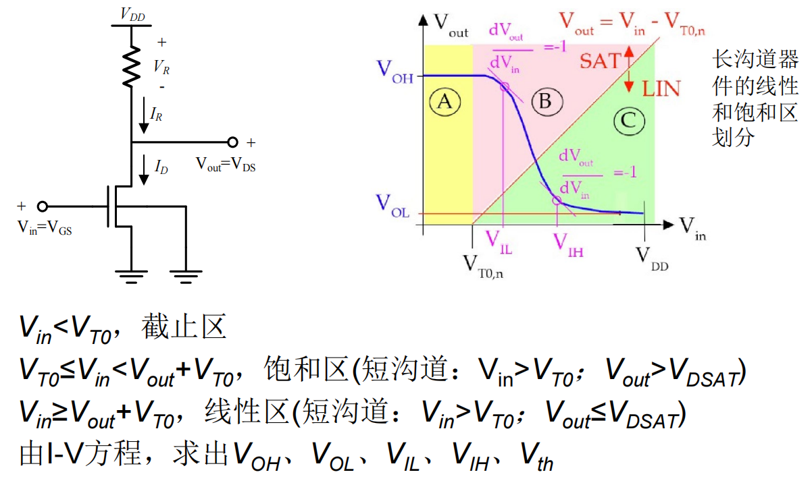

# 数字集成电路设计 - 笔记

## 01 绪论
本课程核心：
- CMOS数字电路基本单元的电路结构、静态和动态性能参数、版图设计等

主要内容：
- COMS反相器（静态特性/开关特性和互连线的影响）
- CMOS组合逻辑电路
- CMOS时序逻辑电路（和组合逻辑电路都属于重点）
- 动态逻辑电路
- 半导体存储器
- 运算电路：全加器/加法器/乘法器/移位器
- 时钟电路和输入输出电路
- 其他：设计方法学/时序问题/EDA设计工具等

绪论内容：
1. 集成电路发展历史：
  - 直接跳过
  - 摩尔定律以及对应的扩展
2. 数字集成电路：
  - 最根本的特征：离散时间/离散幅值
  - 优势：
    - 对待复杂电路能够实现高层次抽象/能够忽略不必要的噪声等实现高精确度/有先进工具支持
3. 同步电路：
  - 所有状态翻转发生在同步时钟的跳变沿，所有触发器状态改变都与时钟同步
  - 优点：
    - 设计方法成熟/EDA软件支持好/可以做STA（静态时序分析）
    - 时钟沿之间可以有glitch，不需要特别考虑竞争与冒险/但需要满足建立时间和保持时间/时钟周期大于最大延迟
  - 设计挑战：
    - 时钟偏斜（clock skew）/要求时钟同步
    - 功耗大/时钟树功耗问题
    - 电路具有强耦合关系，不利于面积优化与低功耗优化，不灵活
      - 强耦合：同步电路中所有电路受统一时钟电路操控，且常有流水线结构，信号沿不同模块层层传递，要是其中一个电路改变，可能会影响下游大量电路
4. 异步电路：
  - 采用请求req和应答ack的握手方式进行通信，没有统一的时钟信号
  - 优势：
    - 功耗低/面积小/无需考虑时钟偏斜
    - 可以针对性优化面积和功耗
  - 设计挑战：
    - 实现握手需要耗费额外的异步控制单元
    - 缺乏成熟的设计方法和EDA工具/设计难度大
    - 验证/性能分析/优化难度大
    - 必须消除电路的竞争/冒险和毛刺
5. 数字电路的设计层次（从高到低）
  - 系统级
  - 算法级
  - 寄存器传输级
  - 门级
  - 晶体管级
  - 版图级
6. 集成电路的成本
  - 芯片成本 = 每个芯片的可变成本 +（固定成本 / 芯片的产量）
  - 其中可变成本是与芯片数量等成比例的
  - 固定成本NRE是可以重复使用的工具/人力/宣传等的费用，其中掩模版制造占主要
  - 其实Die（裸芯）的成本和其面积四次方成正比，所以芯片面积优化对成本有很大影响

部分器件知识：
- 二极管：
  - 数字集成电路/数字IC中的主要作用：反偏隔离+ESD保护
  - 一般不直接使用，但其作为寄生元件几乎无处不在
- MOS晶体管：
  - 以数字方向看，一个MOS晶体管相当于一个开关
  - 长／短沟道的MOS晶体管I-V公式
    - 长沟道NMOS：
      - V_GS<V_T：截止，近似I_D＝０
      - V_DS>V_GS-V_T：饱和区，满足: $I_D=\frac{\mu_nC_{OX}}{2}\frac{W}{L}{(V_{GS}-V_T)}^2(1+\lambda V_{DS})$
      - V_DS<V_GS-V_T：线性区，满足: $I_D=\mu_nC_{OX}\frac{W}{L}((V_{GS}-V_T)V_{DS}-\frac{V_{DS}^2}{2})$
    - 短沟道NMOS：
      - 饱和电压改变（加分之乘）: $V_{DSAT}=\frac{(V_{GS}-V_T)\cdot E_CL}{(V_{GS}-V_T)+E_CL}$
      - 饱和区的IV公式是在长沟道基础上 $\cdot \frac{1}{1+\frac{(V_{GS}-V_T)}{E_CL}}$
      - 线性区的IV公式是在长沟道基础上 $\cdot \frac{1}{1+\frac{V_{DS}}{E_CL}}$
  - 寄生电容
  - 短沟道效应

## 02  MOS反相器静态特性
具体内容：
1. 反相器特性指标/参数：
  - V_OH：最大输出高电平，V_OL：最小输出低电平
    - V_OH越大越好，V_OL越小越好
  - V_IH：最小高输入电平，V_IL：最大低输入电平
  - Vth：反相器逻辑阈值点，Vth=V_in=V_out
  - （以及它们的计算方式：最高最低点/斜率为-1处）
2. 噪声容限：
  - 高电平噪声容限NM_H=V_OH-V_IH
  - 低电平噪声容限NM_L=V_IL-V_OL
  - 影响反相器的抗干扰能力，相对越大反相器性能越好
3. 其他：
  - 芯片功率的限制因素：结温
  - 芯片功耗P：包括静态功耗和动态功耗
    - 静态功耗=直流功耗= $P_{DC}=V_{DD}I_D(V_{in}=V_{OH}orV_{OL})$
    - 若1和0出现的时间均等，则: $P_{DC}=\frac{V_{DD}}{2}\cdot [I_{DC}(V_{in}=V_{OH})+I_{DC}(V_{in}=V_{OL})]$
4. 电阻负载型反相器：
  - 电阻加MOS管，计算核心：I=电阻压降/R=晶体管I-V公式 -> 输出电压和输入电压关系
  - 电压传输特性/VTC曲线（输出电压-输入电压曲线图）
    - 判断曲线上反相器特性参数对应点的位置
    - 判断图上长沟道器件的线性区和饱和区划分
      - 电阻负载型的Vin直接影响V_GS，便于直观判断
      - 对于NMOS: 
  - 计算过程省略，结论如下：
    - V_OH=V_DD
    - $k_nR_L$ 越大，其VTC曲线越接近理想反相器
      - $k_n=\mu_nC_{OX}(W/L)_n$
      - 虽然增大晶体管宽长比（尺寸）和电阻大小可以提高性能，但也会增大面积导致成本升高
    - 静态功耗: $P_{DC}=\frac{V_{DD}}{2}\cdot [0\cdot(V_{in}=V_{DD})+I_{DC}(V_{in}=V_{OL})]=\frac{V_{DD}}{2}\frac{V_{DD}-V_{OL}}{R_L}$
      - 静态功耗与R_L成负相关，在实际应用时要考虑功耗面积的折衷
5. MOS晶体管负载型反相器
  - 

